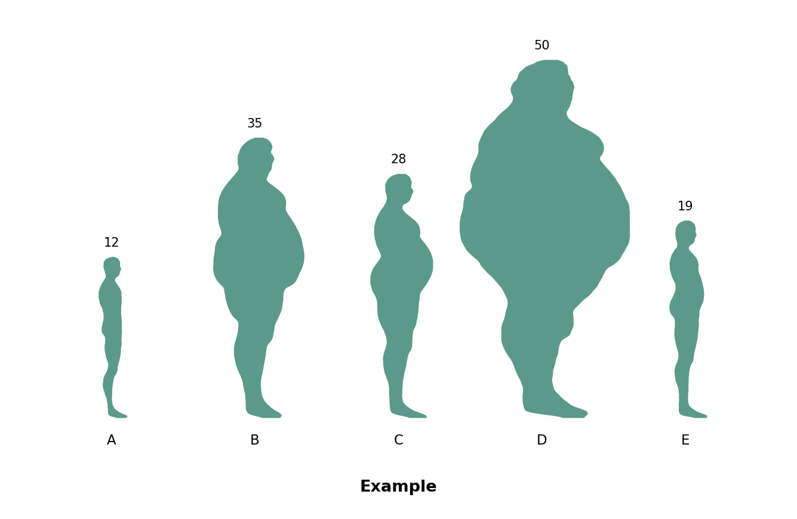

# dfmp

A matplotlib-based library that generates "pictogram people" charts -- bar charts where human silhouettes are horizontally scaled (wider/thinner) and vertically scaled (taller/shorter) to represent data values.



## How it works

Each silhouette is generated by interpolating between pre-computed body profiles stored in `silhouette_data.npz`. The data values are min-max normalized to determine both the "fatness" (horizontal width) and height of each figure. The silhouettes are rendered as `matplotlib.patches.PathPatch` objects, so they integrate naturally with the rest of the matplotlib ecosystem.

## Installation

Requires Python 3.9+.

```bash
pip install git+https://github.com/djemec/dfmp.git
```

Or install locally for development:

```bash
git clone https://github.com/djemec/dfmp.git
cd dfmp
pip install -e ".[dev]"
```

### Dependencies

- matplotlib >= 3.5
- numpy >= 1.21
- scipy >= 1.9

## Quick start

```python
from dfmp import plot

plot(['A', 'B', 'C', 'D', 'E'], [12, 35, 28, 50, 19])
```

The API is designed to mirror `plt.bar()` -- if you know how to make a bar chart, you know how to make a pictogram.

## API

```python
plot(x, height, *, color=None, alpha=None, tick_label=None,
     label=None, show_values=True, value_format=None,
     ax=None, **kwargs)
```

### Parameters

| Parameter | Type | Default | Description |
|---|---|---|---|
| `x` | array-like | *(required)* | String labels or numeric positions. Strings are used as tick labels automatically. |
| `height` | array-like | *(required)* | Data values that drive both fatness and vertical scaling of each silhouette. |
| `color` | str or list | `'#5B9A8B'` | Single color for all figures, or a list of colors (one per figure). |
| `alpha` | float | `None` | Opacity (0--1) applied to every silhouette. |
| `tick_label` | list of str | `None` | Override x-axis labels when `x` is numeric. |
| `label` | str | `None` | Legend label for this set of silhouettes. |
| `show_values` | bool | `True` | Annotate each silhouette with its data value. |
| `value_format` | str or callable | `None` | Format string (e.g. `'{:.1f}%'`) or callable `f(val) -> str` for value annotations. |
| `ax` | Axes | `None` | Target matplotlib axes. Creates a new figure if `None`. |
| `**kwargs` | | | Passed through to `matplotlib.patches.PathPatch`. |

### Returns

`matplotlib.axes.Axes` -- the axes containing the chart (following the seaborn convention).

## Examples

```python
from dfmp import plot
import matplotlib.pyplot as plt

ax = plot(
    ['A', 'B', 'C'],
    [10, 50, 100],
    color=['#E76F51', '#2A9D8F', '#264653'], #optional
    value_format='{:.1f}' # optional
)

#matplotlib config examples
plt.title('My chart')
plt.xlabel('Categories')
plt.show()

# save to a file
ax.figure.savefig('chart.png', dpi=150, bbox_inches='tight', facecolor='white')
```

### Drawing on an existing axes

Pass an `ax` to draw on a pre-existing figure, just like seaborn or matplotlib.

```python
import matplotlib.pyplot as plt
from dfmp import plot

fig, ax = plt.subplots(figsize=(10, 6))
plot(['A', 'B', 'C'], [10, 20, 30], ax=ax)
```

## License

MIT
